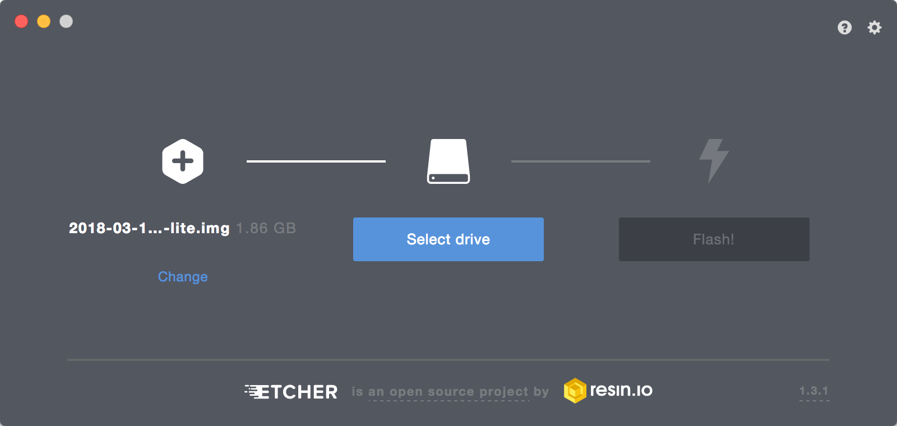
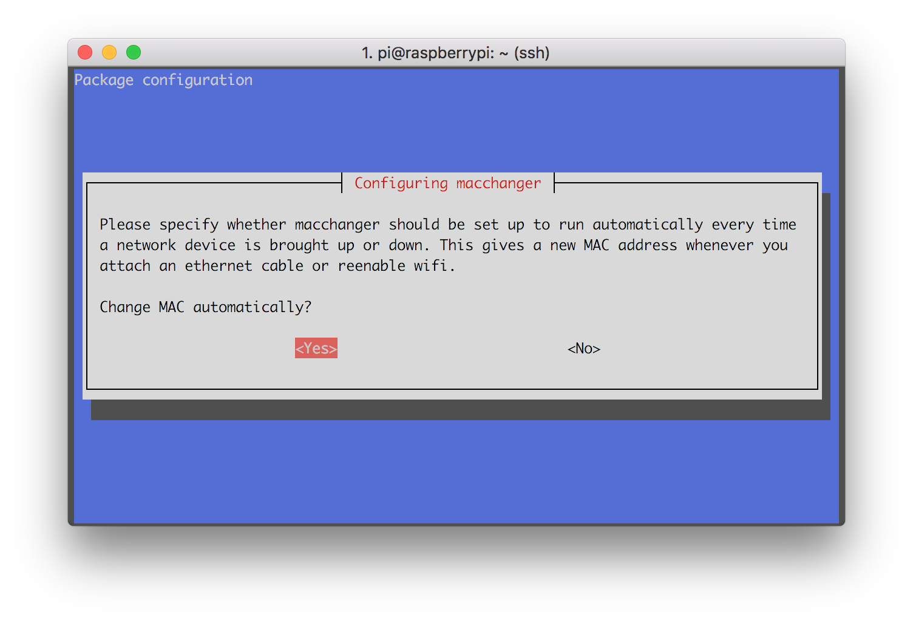

# Building a Rogue AP with the Raspberry Pi Zero W

I embarked upon configuring a Raspberry Pi Zero W to act as a WiFi hotspot and serve up a little Python web app to anyone who connected to it. In researching the topic, I came across this posting from Braindead Security: [Building a Rogue Captive Portal for Raspberry Pi Zero W](https://braindead-security.blogspot.com/2017/06/building-rogue-captive-portal-for.html)

It was almost exactly what I wanted, except for a few things:

1. It was written for Raspbian Jessie Lite. I wanted to use the latest Raspbian Stretch Lite.
2. It set up the system for PHP. I wanted to use Python with Flask and WSGI.
3. It used a hackish startup script in /etc/rc.local. I wanted to figure out how to set up all of the services properly through their respective configuration files instead of brute-forcing it.

So, I've borrowed heavily from Braindead's tutorial, but I've updated it to achieve my goals.

##TL;DR

On a fresh install of Raspbian Stretch Lite, clone https://github.com/jerryryle/rogue_ap and run setup.sh, then reboot. The Pi needs only a power supply and a wireless adapter on wlan0; internet connection is not required.

##Components

You will need the following:

* Raspberry Pi Zero W - though any Raspberry Pi model should work as long as it has a wireless adapter (built in or connected via USB)
* Micro SD card - I'd recommend at least a 4GB class 10 card
* HDMI cable and HDMI-compatible monitor or TV
* USB OTG cable and 2A AC adapter for power
* Keyboard and micro USB adapter or powered USB hub
* WiFi
* Computer with SD card reader to download Raspbian and install it onto the SD card
* Computer or phone with WiFi to test the Rogue AP

##Preparation

First, you need to get the Raspberry Pi up and running. Download the latest image of Raspbian Stretch Lite from https://www.raspberrypi.org/downloads/raspbian/

For writing the image to your SD card, Braindead recommends simplifying the process by using Etcher from https://etcher.io.

Insert the SD card in your computer and use Etcher to copy the Raspbian image to the SD card (it will overwrite any data currently on the card).



When Etcher has finished copying the image, remove the SD card from your computer, plug it into the Raspberry Pi, connect a keyboard and monitor, and plug in the AC adapter. The system should boot to a login prompt. Log in using the default username `pi` and password `raspberry`.

In order to configure the device, you'll need to configure the Raspberry Pi to connect to your WiFi network. Type this command to edit the wireless configuration:
```bash
sudo nano /etc/wpa_supplicant/wpa_supplicant.conf
```

To the end of the file, add the following lines, substituting the name of your local access point and its corresponding password:
```text
network={
    ssid="WiFi Network"
    psk="password"
}
```

To save the file and exit, type `Ctrl-X`, then `y`, then `Enter`. Then, enter the following command to load the new network configuration:
```bash
sudo service networking restart
```

Next, update the system with the following command:
```bash
sudo apt-get update && sudo apt-get dist-upgrade -y
```

After the system has updated, install the additional required packages:
```bash
sudo apt-get install apache2 bridge-utils dnsmasq git hostapd iptables-persistent libapache2-mod-wsgi macchanger python-pip python-flask
```

During the installation of the `macchanger` package, you will be asked whether you'd like `macchanger` to run automatically. Select 'Yes' with the arrow keys and press `Enter`:


Here's what you're installing and why:

* **apache2** - This is the web server that will serve up your content
* **bridge-utils** - Utilities for creating network bridge interfaces. Although hostapd can create the bridge interface for you, it doesn't give you control over the IP address of the interface. Because you need to fix the bridge's IP address, you have to create and configure the interface manually with the tools in this package.
* **dnsmasq** - This provides DNS and DHCP services. You'll configure this to hijack all DNS requests and give responses that direct browsers to your web server.
* **git** - This is needed to clone the repository that contains setup scripts and configuration files. (If you're planning to do all of the setup by hand, you don't need this)
* **hostapd** - This allows you to create a WiFi access point.
* **iptables-persistent** - This allows you to store routing rules in a configuration file that is loaded upon startup. This prevents us from having to manually hack the rules into a startup script.
* **libapache2-mod-wsgi** - This is an Apache module that allows you to host a Python web application.
* **macchanger** - This will randomly change your Raspberry Pi's WiFi MAC address. This makes it difficult for someone to track your Rogue AP or to blacklist it by its MAC address.
* **python-pip** - This is a Python package installer. It's needed to install the Python web app that will control what your Rogue AP actually does.
* **python-flask** - This is a powerful, but lightweight web framework for Python. You can use it to make your Rogue AP do all sorts of fun stuff.

When the installation finishes, restart the Raspberry Pi:
```bash
sudo reboot
```

##Configuring your Rogue AP
###The Quick Way
To configure the system to run the rogue access point, all you need to do is download a repository from GitHub and run the installer. To do this, use these commands (you will be prompted for the name of the WiFi network that your Rogue AP will create):
```bash
git clone https://github.com/jerryryle/rogue_ap.git
cd rogue_ap
sudo ./setup.sh
sudo reboot
```

Once you do this, you will lose internet access since you have converted the Raspberry Pi's wireless hardware from a WiFi client to an Access Point.

If you need to restore WiFi so that you can access the internet from your Raspberry Pi, you can use the `restore_wifi.sh` script to disable the Rogue AP and reconnect to your WiFi network. To do this, run these commands (you will be prompted for your WiFi SSID and password):
```bash
cd rogue_ap
sudo ./restore_wifi.sh
sudo reboot
```

###The Manual Way
Coming soon.